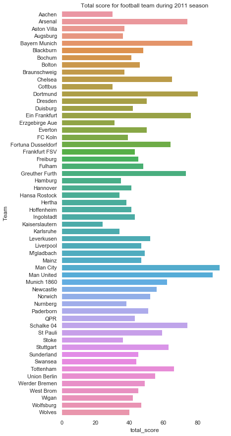
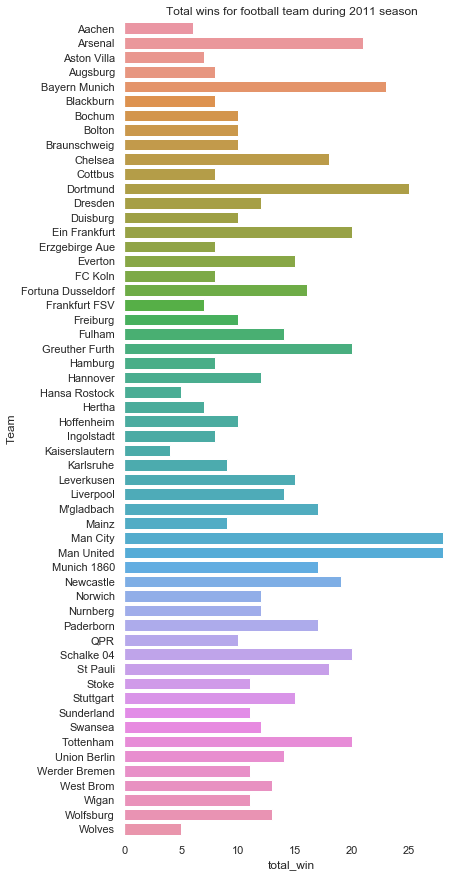
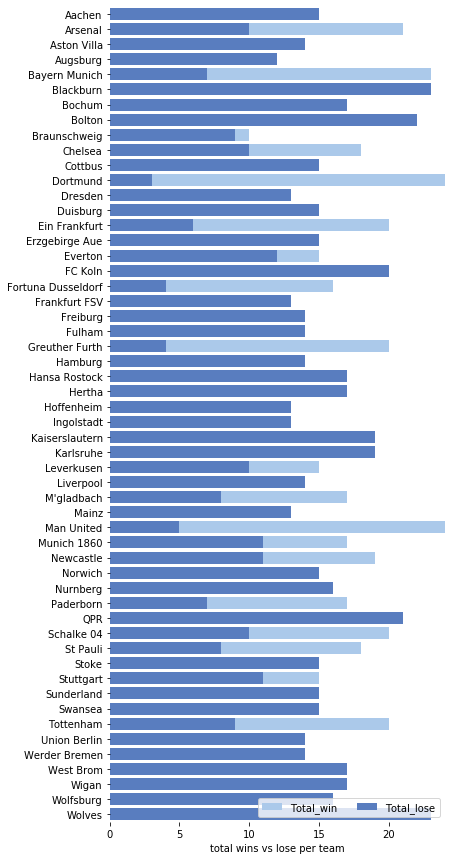

# Module 2 Final Project - Football team analysis

## Student Name: Shuyu WU

## Overview
This is a football analysis for season 2011 consisting of historic match data for the German Bundesliga (1st and 2nd Division) as well as the English Premier League. We will look at the total wins and total scores for each team during the season as well as the total wins vs total loss. Lastly we will analyse team performace during the rainy days and it's win change to play in a rainy day. All the results is accessable through MongoDB.

## Install
This project requires Python 3 and the following Python libraries installed:
- pandas
- sqlite3
- seaborn
- matplotlib.pyplot
- numpy
- json
- requests
- pandasql
- pymongo

## Data
database.sqlite
Darksky API

## Deliverables
- Jupyter notebook
- Total_win_vs_lose.png
- Total_score.png
- Total_win.png
- Mongodb

## Methodology and findings

### Total Scores per Team During 2011 Season
Man city and Man United have the highest scores during the 2011 season.

### Total Wins per Team During 2011 Season
Consistently with the total score graph, Man city and Man United have the hight number of wins

### Win vs Loss per Team During 2011 Season
